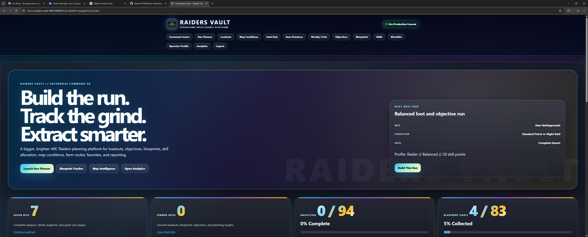
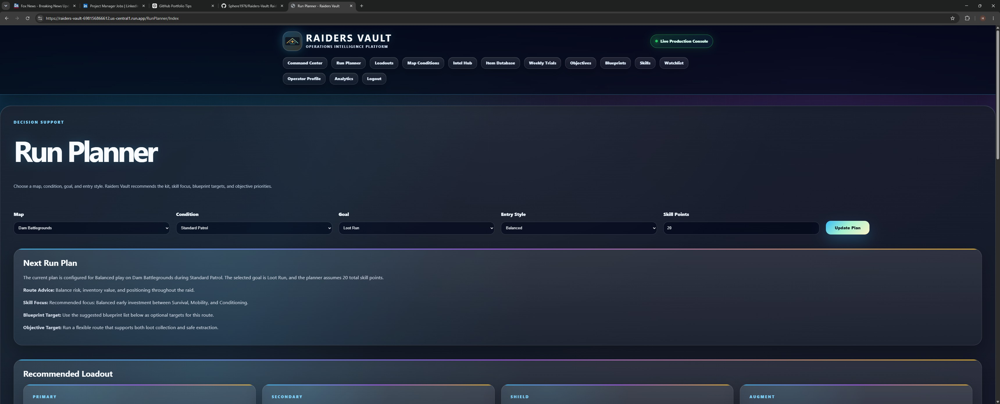
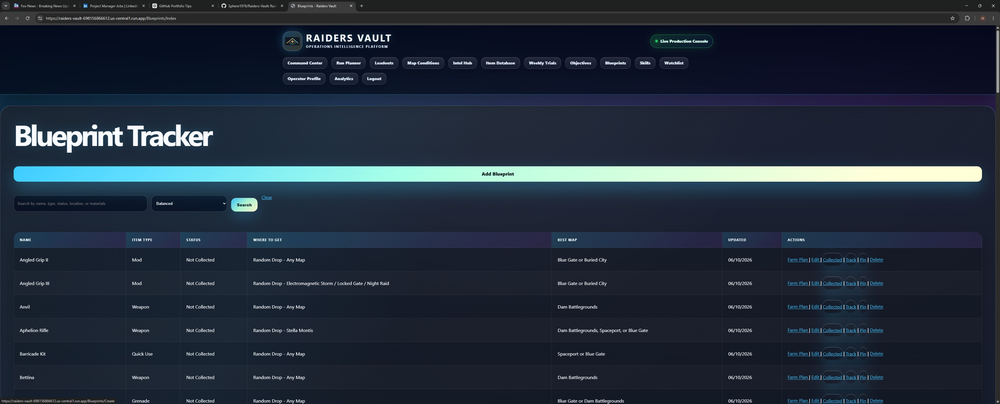
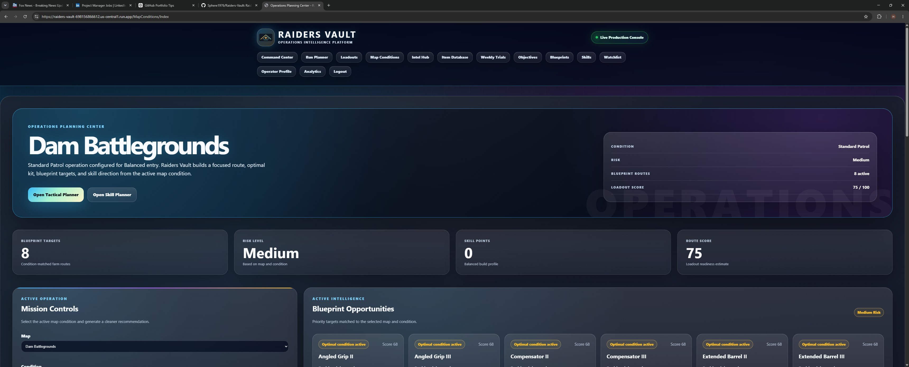
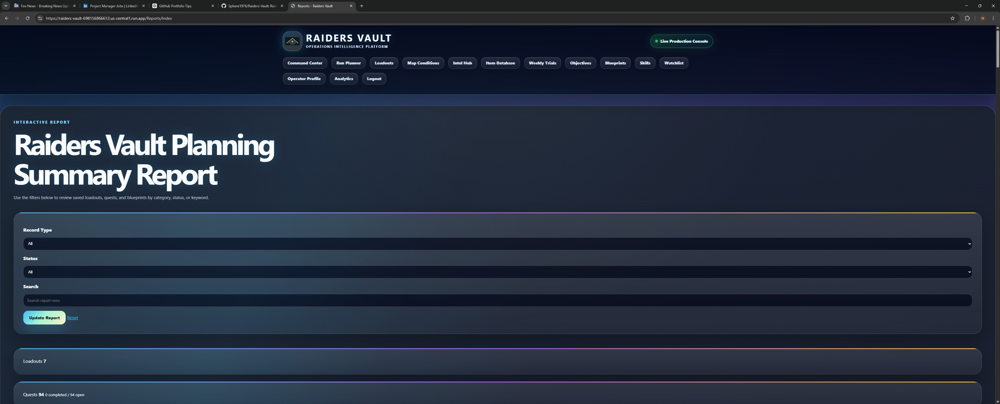
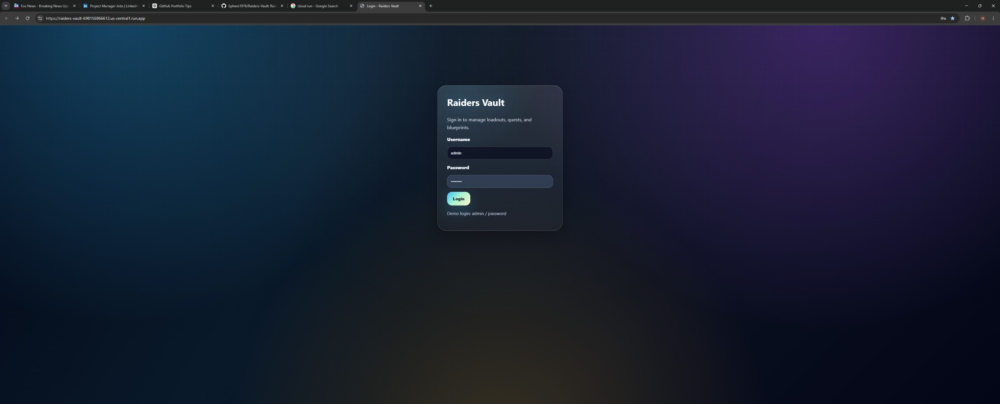

<p align="center">
  
</p>

<h1 align="center">Raiders Vault</h1>

<p align="center">
  <strong>Operations Intelligence Platform for ARC Raiders planning, progression tracking, equipment strategy, and collection analytics.</strong>
</p>

<p align="center">
  <a href="https://raiders-vault-698156866612.us-central1.run.app">Live Demo</a> •
  <a href="#project-overview">Overview</a> •
  <a href="#screenshots">Screenshots</a> •
  <a href="#architecture">Architecture</a> •
  <a href="#resume-ready-summary">Resume Summary</a>
</p>

<p align="center">
  
  
  
  
  
  
  
  
</p>

---

## Project Overview

**Raiders Vault** is a full-stack ASP.NET Core MVC application that turns scattered ARC Raiders planning into a centralized command center. The platform supports loadout management, quest tracking, blueprint collection, map-condition intelligence, skill planning, favorites, farming routes, and operational reporting.

This project is presented as a production-style portfolio application with clean branding, cloud deployment readiness, security-focused defaults, service-layer architecture, and recruiter-friendly documentation.

---

## Product Capabilities

Raiders Vault demonstrates more than basic CRUD. It combines user-facing planning tools, structured data management, recommendation logic, reporting, security controls, and cloud deployment into one cohesive application.

**Portfolio highlights:**

- Built a full-stack ASP.NET Core 8 MVC web application using C#, Razor Views, Entity Framework Core, and SQLite.
- Added a React, TypeScript, and Next.js companion console under `frontend/raiders-vault-next`.
- Added a Java and Spring Boot live-ops REST service under `Services/liveops-spring` with JUnit/MockMvc coverage.
- Added AWS Terraform infrastructure under `infra/aws/terraform` for ECS Fargate, ALB, VPC networking, IAM, and CloudWatch logs.
- Added OpenAPI, Playwright, JUnit, Cucumber, Postman, Docker Compose, CloudFormation, and GitHub Actions assets to demonstrate test automation and CI/CD practices.
- Designed CRUD workflows for loadouts, quests, and blueprints with search, status tracking, and user-friendly navigation.
- Implemented service-layer logic for loadout recommendations, blueprint farm planning, map-condition matching, and summary reports.
- Configured deployment readiness with Docker, Google Cloud Run compatibility, and a health-check endpoint.
- Added security-focused web defaults including session cookies, anti-forgery validation, and security response headers.

---

## Screenshots

### Command Center Dashboard

<p align="center">
  
</p>

Centralized operational dashboard displaying saved kits, pinned intel, objective progress, blueprint progress, and next-run recommendations.

### Run Planner

<p align="center">
  
</p>

Decision-support workflow for map selection, route strategy, skill focus, blueprint targets, and recommended loadout planning.

### Blueprint Intelligence

<p align="center">
  
</p>

Collection management system for tracking missing blueprints, farming routes, item types, map recommendations, and collection status.

### Map Conditions

<p align="center">
  
</p>

Operational intelligence dashboard that evaluates active map conditions, risk level, blueprint opportunities, and route readiness.

### Reports and Analytics

<p align="center">
  
</p>

Interactive reporting engine for reviewing loadouts, quests, blueprints, status filters, and summary metrics.

### Login Experience

<p align="center">
  
</p>

Clean authentication entry point with the Raiders Vault visual design system.

---

## Architecture

<p align="center">
  
</p>

### Application Flow

```text
Browser Client
   ↓
ASP.NET Core MVC
   ↓
Controllers + Razor Views
   ↓
Application Services
   ↓
Entity Framework Core
   ↓
SQLite Database
   ↓
Docker / Google Cloud Run
```

Additional modernization folders:

- `frontend/raiders-vault-next` - React, TypeScript, and Next.js companion console.
- `Services/liveops-spring` - Java and Spring Boot REST service with JUnit/MockMvc tests.
- `gateway/graphql-bff` - Spring GraphQL backend-for-frontend facade.
- `mobile/raiders-vault-mobile` - Expo/React Native companion app scaffold.
- `infra/aws/terraform` - AWS ECS Fargate, ALB, VPC, IAM, and CloudWatch Terraform blueprint.
- `infra/aws/cloudformation` - CloudFormation alternative for AWS-native infrastructure review.
- `infra/kubernetes` and `infra/helm` - Kubernetes, Kustomize, and Helm deployment manifests.
- `infra/eventbridge`, `infra/data-warehouse`, and `infra/policy` - Event-driven, analytics, and policy-as-code expansion layers.
- `docs/api` - OpenAPI contract for MVC and Spring service boundaries.
- `docs/security`, `docs/observability`, and `docs/release` - Threat model, SLOs, telemetry plan, and release governance.
- `docs/adr` and `docs/product` - Architecture decisions and PRD-style product collaboration artifacts.
- `tests/postman` - Postman API collection for health and live-ops contracts.

---

## Features

| Domain | Capability |
|---|---|
| Loadout Operations | Create, edit, score, search, compare, and manage loadouts. |
| Quest Tracking | Track active, completed, and reopened objectives. |
| Blueprint Intelligence | Monitor collected and missing blueprints with farming context. |
| Run Planning | Recommend farming strategies based on map, condition, and goal. |
| Map Conditions | Evaluate active conditions and matching strategy recommendations. |
| Skill Planning | Build PvE, PvP, and balanced progression paths. |
| Watchlist | Pin high-value records for quick access. |
| Reports | Generate operational summaries across core data sets. |

---

## Technology Stack

### Backend

- C#
- ASP.NET Core 8 MVC
- Entity Framework Core
- SQLite
- LINQ
- Dependency Injection
- Service-layer architecture
- Java 21
- Spring Boot 3
- Spring MVC REST controllers
- Spring GraphQL
- JUnit and MockMvc

### Frontend

- React
- TypeScript
- Next.js
- React Native / Expo scaffold
- Razor Views
- HTML5
- CSS3
- JavaScript
- Responsive layout structure

### Cloud and DevOps

- Dockerfile included
- Google Cloud Run compatible
- AWS ECS Fargate Terraform blueprint
- Application Load Balancer, VPC, IAM execution role, CloudWatch logs
- CloudFormation reference stack
- Kubernetes, Kustomize, and Helm platform manifests
- Docker Compose full-stack local orchestration
- k6 performance smoke test
- EventBridge reference architecture
- Data warehouse schema and analytics views
- Rego policy-as-code guardrails
- CodeQL, dependency review, and SBOM workflow
- xUnit integration tests for the ASP.NET Core app
- GitHub Actions CI for .NET, Next.js, Spring Boot, Playwright, and Terraform validation
- Health check endpoint: `/health`
- CI workflow support
- Environment-aware cookie security configuration

---

## Security Features

- Anti-forgery validation on MVC actions
- HttpOnly session cookies
- Strict SameSite cookie policy
- Secure cookies outside local development
- Fixed-time password hash comparison
- Input sanitization helper
- Content Security Policy
- X-Frame-Options
- X-Content-Type-Options
- Referrer Policy
- Permissions Policy

---

## Repository Structure

```text
RaidersVault/
├── Controllers/              # MVC request handlers
├── Data/                     # EF Core context and data access
├── Middleware/               # Security and platform middleware
├── Models/                   # Domain entities
├── Services/                 # Business logic and recommendation services
├── ViewModels/               # UI-specific data contracts
├── Views/                    # Razor UI
├── wwwroot/                  # CSS, images, static assets
├── docs/                     # Architecture and product documentation
├── .github/workflows/        # CI pipeline
├── Dockerfile                # Container deployment
└── RaidersVault.csproj       # .NET project file
```

---

## Getting Started

### Requirements

- .NET 8 SDK
- Visual Studio 2022, VS Code, or JetBrains Rider

### Run Locally

```bash
dotnet restore
dotnet build
dotnet run
```

The SQLite database is created and seeded automatically on first launch.

### Default Development Login

```text
Username: admin
Password: password
```

For public deployment, replace the seeded development account with an environment-driven identity strategy.

---

## Docker Deployment

```bash
docker build -t raiders-vault .
docker run -p 8080:8080 raiders-vault
```

---

## Google Cloud Run Deployment

```bash
gcloud run deploy raiders-vault \
  --source . \
  --region us-central1 \
  --platform managed \
  --allow-unauthenticated
```

---

## Enterprise Upgrade Roadmap

See [`docs/ENTERPRISE_UPGRADE.md`](docs/ENTERPRISE_UPGRADE.md) for the full modernization plan.
See [`docs/FULLSTACK_JOB_ALIGNMENT.md`](docs/FULLSTACK_JOB_ALIGNMENT.md) for the React, TypeScript, Next.js, Spring Boot, AWS, Terraform, testing, and CI/CD job-alignment matrix.
See [`docs/FULLSTACK_RUNBOOK.md`](docs/FULLSTACK_RUNBOOK.md) for local, container, test, and infrastructure validation commands.
See [`docs/portfolio/CASE_STUDY.md`](docs/portfolio/CASE_STUDY.md), [`docs/portfolio/RECRUITER_ONE_PAGER.md`](docs/portfolio/RECRUITER_ONE_PAGER.md), and [`docs/interview/STAR_STORIES.md`](docs/interview/STAR_STORIES.md) for application-ready talking points.

High-impact future upgrades:

- ASP.NET Core Identity or external OAuth provider
- PostgreSQL or SQL Server production database
- Role-based access control
- Audit logging
- API layer with OpenAPI/Swagger
- Automated tests and coverage gates
- Structured logging with correlation IDs
- CI/CD deployment pipeline
- Observability dashboards
- Multi-user cloud synchronization

---

## Resume-Ready Summary

**Raiders Vault** is a production-style operations intelligence platform built with ASP.NET Core MVC, C#, Entity Framework Core, SQLite, Razor Views, React, TypeScript, Next.js, Java, Spring Boot, Docker, AWS Terraform, and Google Cloud Run. It centralizes ARC Raiders planning through loadout management, quest tracking, blueprint collection, map-condition intelligence, skill planning, favorites, farm-route recommendations, and reporting.

**Resume bullet:**

> Designed and deployed a full-stack ASP.NET Core MVC planning platform with EF Core persistence, SQLite data storage, service-layer recommendation logic, secure session handling, reporting workflows, and Google Cloud Run deployment readiness.
> Expanded Raiders Vault into a full-stack engineering monorepo with a typed Next.js frontend, Expo mobile scaffold, Java Spring Boot REST service, Spring GraphQL BFF, AWS Terraform/CloudFormation/Kubernetes/Helm infrastructure, EventBridge events, analytics warehouse SQL, Rego policies, OpenAPI contracts, xUnit/Playwright/JUnit/Cucumber/Postman/k6 tests, Docker Compose orchestration, CodeQL/SBOM security automation, Dependabot governance, threat modeling, SLO documentation, case-study artifacts, and GitHub Actions CI/CD validation.

---

## Author

**Steven Buchholtz**  
Software Engineer | Full-Stack Developer  
C# • ASP.NET Core • EF Core • SQLite • Cloud Deployment • Product Architecture

---

## License

See `docs/PRODUCTION_READINESS.md` and `docs/DEPLOYMENT_RUNBOOK.md` for portfolio talking points, validation steps, and deployment instructions.
