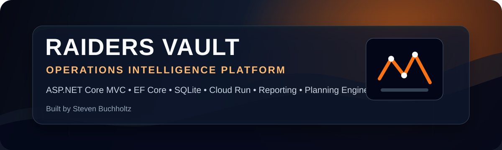
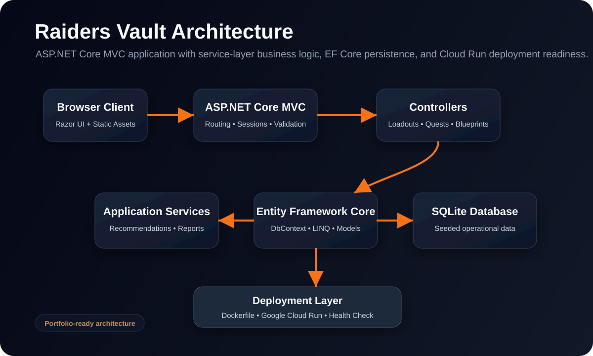

<p align="center">
  
</p>

<h1 align="center">Raiders Vault</h1>

<p align="center">
  <strong>Operations Intelligence Platform for ARC Raiders planning, progression tracking, equipment strategy, and collection analytics.</strong>
</p>

<p align="center">
  <a href="https://raiders-vault-698156866612.us-central1.run.app">Live Demo</a> •
  <a href="#project-overview">Overview</a> •
  <a href="#architecture">Architecture</a> •
  <a href="#features">Features</a> •
  <a href="#resume-ready-summary">Resume Summary</a>
</p>

<p align="center">
  
  
  
  
  
</p>

---

## Project Overview

**Raiders Vault** is a full-stack ASP.NET Core MVC application that turns scattered ARC Raiders planning into a centralized command center. The platform supports loadout management, quest tracking, blueprint collection, map-condition intelligence, skill planning, favorites, farming routes, and operational reporting.

This project is presented as a production-style portfolio application with clean branding, cloud deployment readiness, security-focused defaults, service-layer architecture, and recruiter-friendly documentation.

---

## Why It Stands Out

Raiders Vault demonstrates more than basic CRUD. It combines user-facing planning tools, structured data management, recommendation logic, reporting, security controls, and cloud deployment into one cohesive application.

**Portfolio highlights:**

- Built a full-stack ASP.NET Core 8 MVC web application using C#, Razor Views, Entity Framework Core, and SQLite.
- Designed CRUD workflows for loadouts, quests, and blueprints with search, status tracking, and user-friendly navigation.
- Implemented service-layer logic for loadout recommendations, blueprint farm planning, map-condition matching, and summary reports.
- Configured deployment readiness with Docker, Google Cloud Run compatibility, and a health-check endpoint.
- Added security-focused web defaults including session cookies, anti-forgery validation, and security response headers.

---

## Screenshots

Production screenshots can be added under `wwwroot/images/portfolio/`.

| Area | Purpose | Suggested File |
|---|---|---|
| Command Center | Shows dashboard metrics and operational overview | `dashboard.png` |
| Run Planner | Demonstrates map condition planning and loadout recommendations | `run-planner.png` |
| Blueprint Intelligence | Shows collection tracking and farm planning | `blueprints.png` |
| Map Conditions | Highlights supported map conditions and strategy context | `map-intel.png` |
| Reports | Shows summary reporting and analytics output | `reports.png` |

Example reference format after screenshots are added:

```md

```

---

## Architecture

<p align="center">
  
</p>

### Application Flow

```text
Browser Client
   ↓
ASP.NET Core MVC
   ↓
Controllers + Razor Views
   ↓
Application Services
   ↓
Entity Framework Core
   ↓
SQLite Database
   ↓
Docker / Google Cloud Run
```

---

## Features

| Domain | Capability |
|---|---|
| Loadout Operations | Create, edit, score, search, compare, and manage loadouts. |
| Quest Tracking | Track active, completed, and reopened objectives. |
| Blueprint Intelligence | Monitor collected and missing blueprints with farming context. |
| Run Planning | Recommend farming strategies based on map, condition, and goal. |
| Map Conditions | Evaluate active conditions and matching strategy recommendations. |
| Skill Planning | Build PvE, PvP, and balanced progression paths. |
| Watchlist | Pin high-value records for quick access. |
| Reports | Generate operational summaries across core data sets. |

---

## Technology Stack

### Backend

- C#
- ASP.NET Core 8 MVC
- Entity Framework Core
- SQLite
- LINQ
- Dependency Injection
- Service-layer architecture

### Frontend

- Razor Views
- HTML5
- CSS3
- JavaScript
- Responsive layout structure

### Cloud and DevOps

- Dockerfile included
- Google Cloud Run compatible
- Health check endpoint: `/health`
- CI workflow support
- Environment-aware cookie security configuration

---

## Security Features

- Anti-forgery validation on MVC actions
- HttpOnly session cookies
- Strict SameSite cookie policy
- Secure cookies outside local development
- Fixed-time password hash comparison
- Input sanitization helper
- Content Security Policy
- X-Frame-Options
- X-Content-Type-Options
- Referrer Policy
- Permissions Policy

---

## Repository Structure

```text
RaidersVault/
├── Controllers/              # MVC request handlers
├── Data/                     # EF Core context and data access
├── Middleware/               # Security and platform middleware
├── Models/                   # Domain entities
├── Services/                 # Business logic and recommendation services
├── ViewModels/               # UI-specific data contracts
├── Views/                    # Razor UI
├── wwwroot/                  # CSS, images, static assets
├── docs/                     # Architecture and product documentation
├── .github/workflows/        # CI pipeline
├── Dockerfile                # Container deployment
└── RaidersVault.csproj       # .NET project file
```

---

## Getting Started

### Requirements

- .NET 8 SDK
- Visual Studio 2022, VS Code, or JetBrains Rider

### Run Locally

```bash
dotnet restore
dotnet build
dotnet run
```

The SQLite database is created and seeded automatically on first launch.

### Default Development Login

```text
Username: admin
Password: password
```

For public deployment, replace the seeded development account with an environment-driven identity strategy.

---

## Docker Deployment

```bash
docker build -t raiders-vault .
docker run -p 8080:8080 raiders-vault
```

---

## Google Cloud Run Deployment

```bash
gcloud run deploy raiders-vault \
  --source . \
  --region us-central1 \
  --platform managed \
  --allow-unauthenticated
```

---

## Enterprise Upgrade Roadmap

See [`docs/ENTERPRISE_UPGRADE.md`](docs/ENTERPRISE_UPGRADE.md) for the full modernization plan.

High-impact future upgrades:

- ASP.NET Core Identity or external OAuth provider
- PostgreSQL or SQL Server production database
- Role-based access control
- Audit logging
- API layer with OpenAPI/Swagger
- Automated tests and coverage gates
- Structured logging with correlation IDs
- CI/CD deployment pipeline
- Observability dashboards
- Multi-user cloud synchronization

---

## Resume-Ready Summary

**Raiders Vault** is a production-style operations intelligence platform built with ASP.NET Core MVC, C#, Entity Framework Core, SQLite, Razor Views, Docker, and Google Cloud Run. It centralizes ARC Raiders planning through loadout management, quest tracking, blueprint collection, map-condition intelligence, skill planning, favorites, farm-route recommendations, and reporting.

**Resume bullet:**

> Designed and deployed a full-stack ASP.NET Core MVC planning platform with EF Core persistence, SQLite data storage, service-layer recommendation logic, secure session handling, reporting workflows, and Google Cloud Run deployment readiness.

---

## Author

**Steven Buchholtz**  
Software Engineer | Full-Stack Developer  
C# • ASP.NET Core • EF Core • SQLite • Cloud Deployment • Product Architecture

---

## License

Portfolio demonstration project.
