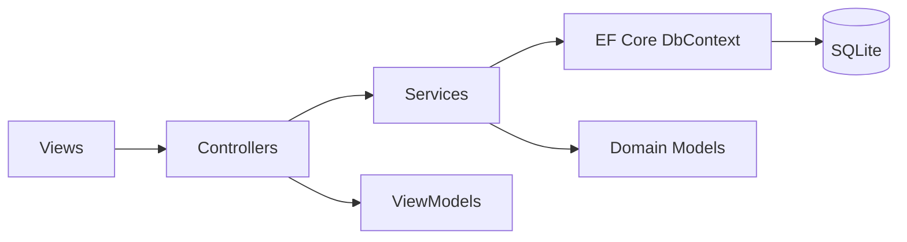
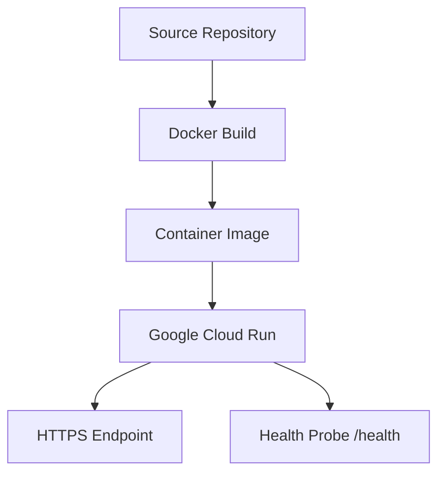

# Raiders Vault Architecture

## Application Style

Raiders Vault is an ASP.NET Core MVC application using server-rendered Razor views, EF Core persistence, and service-layer business logic.

## Logical Layers

## Core Services

- `LoadoutRecommendationService`
- `BlueprintRecommendationService`
- `ReportService`
- `InputSanitizer`

## Security Architecture

- MVC anti-forgery validation is applied globally.
- Session cookies are HttpOnly and SameSite Strict.
- Deployed environments use secure cookies.
- Security headers are applied through custom middleware.
- Login password comparison uses fixed-time comparison.

## Deployment Architecture

## Production Database Recommendation

For enterprise use, replace local SQLite with managed PostgreSQL or SQL Server and use EF Core migrations for controlled schema changes.
